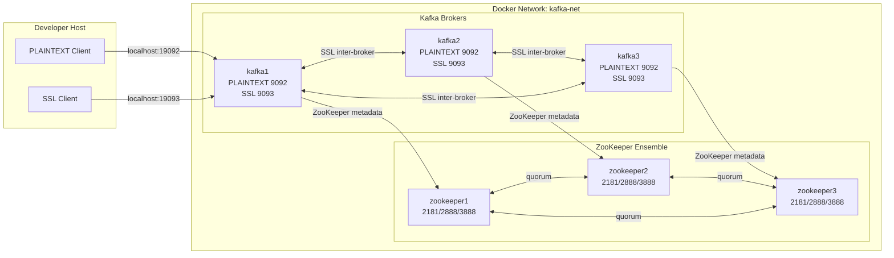

# Kafka 3.9.2 + ZooKeeper 3.9.5 — Docker Compose Lab

A reproducible, expandable **ZooKeeper-based** Apache Kafka cluster in Docker
Compose, with PLAINTEXT and SSL listeners and SSL inter-broker traffic. This is
the modern replacement for the legacy bare-metal/Systemd scripts in this repo.

> Branch: `kafka-distributed` · ZooKeeper mode · Kafka **3.9.2** · ZooKeeper **3.9.5**

---

## 1. Project Overview

- 3 Kafka brokers + 3 ZooKeeper nodes by default; expandable to 5/7/10+ brokers.
- One generator (`scripts/render-compose.py`) produces the whole Compose file
  with unique broker IDs, volumes, listeners, ports, and per-broker certs.
- Security mode selectable from `.env`: `plaintext`, `ssl`, or `dual`.
- Certificates either **generated** (lab CA) or **imported** (enterprise PKI),
  all PKCS12, all openssl-only (no `keytool`/Java needed on the host).
- Internet **and** air-gapped image builds.

## 2. Why Kafka 3.9.2 and ZooKeeper 3.9.5

- **3.9.x is the last Kafka line that supports ZooKeeper mode.** This branch is
  specifically about ZooKeeper-based Kafka, so 3.9.2 is the right, current choice
  (`kafka_2.13-3.9.2.tgz`).
- **ZooKeeper 3.9.5** is the current 3.9 release (`apache-zookeeper-3.9.5-bin.tar.gz`),
  a large jump from the legacy 3.5.8 with logback-based logging and security fixes.

## 3. Why Kafka 4.x is NOT used in this branch

Kafka **4.0 removed ZooKeeper mode** — 4.x is **KRaft-only**. Putting 4.x here
would contradict the entire point of this branch. KRaft gets its own branch:

```text
kafka-distributed (this branch)        feature/docker-compose-kafka-kraft (future)
  Kafka 3.9.2                            Kafka 4.3.0+
  external ZooKeeper 3.9.5               no ZooKeeper (KRaft controllers)
  PLAINTEXT + SSL, min 3 brokers         PLAINTEXT + SSL
```

## 4. Architecture

See [docs/architecture.md](docs/architecture.md) for the full diagram and startup flow.



### Ports

| Service | Internal port | Host port |
|---------|---------------|-----------|
| kafka1 | 9092 PLAINTEXT | 19092 |
| kafka2 | 9092 PLAINTEXT | 29092 |
| kafka3 | 9092 PLAINTEXT | 39092 |
| kafka1 | 9093 SSL | 19093 |
| kafka2 | 9093 SSL | 29093 |
| kafka3 | 9093 SSL | 39093 |
| zookeeper1 | 2181 | not exposed by default |
| zookeeper2 | 2181 | not exposed by default |
| zookeeper3 | 2181 | not exposed by default |

ZooKeeper quorum ports `2888`/`3888` stay internal to `kafka-net`.

## 5. Repository Structure

```text
.
├── README.md
├── docker-compose.yml            # pre-rendered default (3+3, dual)
├── docker-compose.plaintext.yml  # pre-rendered plaintext variant
├── docker-compose.ssl.yml        # pre-rendered ssl variant
├── docker-compose.generated.yml  # produced by `make render` (git-ignored)
├── .env.example                  # fully documented config
├── Makefile
├── images/
│   ├── kafka/        Dockerfile, entrypoint.sh, templates/
│   └── zookeeper/    Dockerfile, entrypoint.sh, templates/
├── certs/
│   ├── openssl/      root-ca.cnf, intermediate-ca.cnf, broker-san.cnf.tpl
│   └── generated/    OUTPUT (git-ignored)
├── config/
│   ├── plaintext/client.properties
│   └── ssl/client.properties
├── scripts/          render-compose.py, prepare/generate/import certs, helpers
├── docs/             architecture, migration, ssl-design, scaling, airgapped, troubleshooting
└── vendor/           air-gapped tarballs (git-ignored)
```

## 6. Quick Start

```bash
cp .env.example .env          # or: make env
make certs                    # SSL material (dual mode default)
make render BROKERS=3 ZOOKEEPERS=3
make build
make up
make ps                       # wait until healthy
make create-topic TOPIC=test-events
make list-topics
make describe
make down
```

`docker` + `docker compose` are the only host prerequisites (the Kafka CLI runs
inside the containers).

## 7. SSL Quick Start

```env
KAFKA_SECURITY_MODE=ssl
KAFKA_CERT_MODE=generate
```

```bash
make certs
make render
make up
make create-topic TOPIC=test-events SECURITY=ssl
make produce-ssl  TOPIC=test-events     # type messages, Ctrl-D
make consume-ssl  TOPIC=test-events     # Ctrl-C to stop
```

## 8. PLAINTEXT Quick Start

```env
KAFKA_SECURITY_MODE=plaintext
```

```bash
make render            # certs not required in plaintext mode
make up
make create-topic TOPIC=test-events
make produce-plaintext TOPIC=test-events
make consume-plaintext TOPIC=test-events
```

## 9. Scaling Beyond 3 Brokers

```bash
make certs  BROKERS=5
make render BROKERS=5 ZOOKEEPERS=3
make up
```

ZooKeeper stays at 3 (or 5) regardless of broker count — it is a metadata
quorum, not a data plane. Full rules and rationale in [docs/scaling.md](docs/scaling.md).

## 10. Air-Gapped Build

Place the **binary** tarballs in `vendor/` and build offline:

```text
vendor/kafka_2.13-3.9.2.tgz
vendor/apache-zookeeper-3.9.5-bin.tar.gz   # the -bin artifact, not source
```

```bash
make vendor-sync   # copies provided packages/ tarballs into vendor/ (if present)
make build
```

Details and caveats: [docs/airgapped-build.md](docs/airgapped-build.md).

## 11. Certificate Generation

```bash
make certs          # generate (lab CA) or import (enterprise PKI), per .env
```

- `KAFKA_CERT_MODE=generate` → Root CA → Intermediate CA → per-broker certs
  (with SANs) → PKCS12 keystores/truststores + client truststore.
- `KAFKA_CERT_MODE=import` → validates and wraps your existing CA/broker certs.

Design and SAN requirements: [docs/ssl-design.md](docs/ssl-design.md).

## 12. Client Connection Examples

In-network (any broker discovers the whole cluster from metadata):

```bash
# PLAINTEXT
kafka-console-producer.sh --bootstrap-server kafka1:9092 --topic test-events
# SSL (in-container client config written by the entrypoint)
kafka-console-producer.sh --bootstrap-server kafka1:9093 --topic test-events \
  --producer.config /etc/kafka/secrets/healthcheck.properties
```

From the host (requires a local Kafka CLI):

```bash
kafka-console-consumer.sh --bootstrap-server localhost:19092 --topic test-events --from-beginning
kafka-console-consumer.sh --bootstrap-server localhost:19093 --topic test-events --from-beginning \
  --consumer.config config/ssl/client.properties
```

## 13. Migration from Legacy Systemd Scripts

The old `kafka/Install-Kafka.sh`, `zookeeper/Install-ZooKeeper.sh`, and
`Set-ServerBaselineConfig.sh` (Kafka 2.5.0 / ZooKeeper 3.5.8, JKS, firewalld,
hardcoded passwords) map directly onto this design — see
[docs/migration-from-systemd.md](docs/migration-from-systemd.md).

## 14. Troubleshooting

Common failures (ZK not `imok`, SSL handshake, SANs, RF too high, port in use,
stale volumes) and fixes: [docs/troubleshooting.md](docs/troubleshooting.md).

## 15. Environment Configuration

Every variable is documented in [.env.example](.env.example). Key selectors:

| Variable | Required | Default | Description |
|----------|----------|---------|-------------|
| `KAFKA_SECURITY_MODE` | yes | `dual` | `plaintext` \| `ssl` \| `dual` |
| `KAFKA_CERT_MODE` | yes | `generate` | `generate` local CA, or `import` external certs |
| `EXTERNAL_ROOT_CA_CERT` | import | empty | Path to existing Root CA certificate |
| `EXTERNAL_INTERMEDIATE_CA_CERT` | optional | empty | Path to existing Intermediate CA |
| `EXTERNAL_BROKER_CERTS_DIR` | import | empty | Dir with `kafkaN.crt` / `kafkaN.key` |
| `KAFKA_SSL_PASSWORD` | ssl/dual | `changeit` | Password for PKCS12 stores |
| `SSL_CLIENT_AUTH` | optional | `none` | `none` or `required` (mTLS) |
| `BROKER_COUNT` | yes | `3` | Number of Kafka brokers (≥3) |
| `ZOOKEEPER_COUNT` | yes | `3` | Number of ZooKeeper nodes (3 or 5) |

### Example: dual mode (both listeners)

```env
KAFKA_SECURITY_MODE=dual
INTER_BROKER_LISTENER_NAME=SSL
KAFKA_CERT_MODE=generate
BROKER_COUNT=3
ZOOKEEPER_COUNT=3
```

```bash
make certs && make render && make up
make produce-plaintext TOPIC=test-events
make produce-ssl       TOPIC=test-events
```

### Example: import enterprise CA + broker certs

```env
KAFKA_SECURITY_MODE=ssl
KAFKA_CERT_MODE=import
EXTERNAL_ROOT_CA_CERT=/secure/pki/root-ca.crt
EXTERNAL_INTERMEDIATE_CA_CERT=/secure/pki/intermediate-ca.crt
EXTERNAL_BROKER_CERTS_DIR=/secure/pki/kafka-brokers   # kafka1.crt/.key, kafka2.crt/.key, ...
KAFKA_SSL_PASSWORD=change-this
```

```bash
make certs && make render && make up
```

## 16. Security Notes

- This is a **lab / development** cluster.
- **Do not** use the default passwords (`changeit`) in production.
- **Do not** commit `.env`, generated private keys, or certificates — all are git-ignored.
- Use a real secrets manager in production.
- Use **mTLS** (`SSL_CLIENT_AUTH=required`) if client authentication is needed.
- Add **SASL / authorization (ACLs)** for real multi-tenant access control.

## 17. Future KRaft Branch

When this branch is stable, the KRaft variant goes in
`feature/docker-compose-kafka-kraft`: Kafka 4.3.0+, no ZooKeeper, KRaft
controllers + brokers, PLAINTEXT + SSL. Keep the two cleanly separated — do not
mix KRaft and ZooKeeper concerns in one branch.
