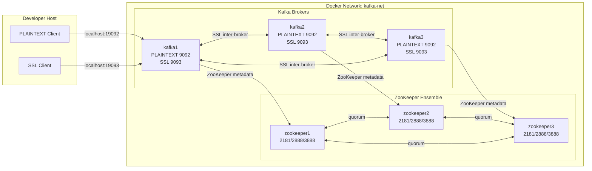

# Architecture

A ZooKeeper-based Apache Kafka cluster running entirely in Docker Compose.

```text
Apache Kafka      3.9.2   (kafka_2.13-3.9.2.tgz)   — ZooKeeper mode, NOT KRaft
Apache ZooKeeper  3.9.5   (apache-zookeeper-3.9.5-bin.tar.gz)
Java runtime      17      (eclipse-temurin:17-jre)
Default topology  3 Kafka brokers + 3 ZooKeeper nodes
Listeners         PLAINTEXT (9092) and/or SSL (9093), inter-broker SSL by default
```

## Components

| Layer | Container(s) | Internal ports | Purpose |
|-------|--------------|----------------|---------|
| Coordination | `zookeeper1..N` | 2181 (client), 2888 (peer), 3888 (election) | Quorum, broker registration, controller election, topic metadata |
| Brokers | `kafka1..M` | 9092 (PLAINTEXT), 9093 (SSL) | Message storage and serving |
| Network | `kafka-net` (bridge) | — | Private DNS (`kafka1`, `zookeeper1`, …) |

## Topology diagram



## How a broker starts

1. Compose builds the image (from `vendor/` tarball if present, else downloads from Apache).
2. `depends_on … condition: service_healthy` holds the broker until every ZooKeeper node passes its `ruok`/`imok` healthcheck.
3. The broker entrypoint renders `/opt/kafka/config/server.properties` from a template based on `KAFKA_SECURITY_MODE`, injecting listeners, the ZooKeeper connect string, and (when SSL is enabled) the PKCS12 store configuration.
4. In SSL/dual mode the entrypoint refuses to start if the keystore or the CA trust material is missing — run `make certs` first.
5. `kafka-server-start.sh` launches the broker in the foreground (PID 1).

## Data persistence

Each broker and ZooKeeper node has its own **named Docker volume**, so data
survives `docker compose restart` and `down` (without `-v`):

```text
kafka1-data → /var/lib/kafka/data
zookeeper1-data → /var/lib/zookeeper/data   (snapshots + myid)
zookeeper1-log  → /var/lib/zookeeper/log     (transaction log)
```

## Listener / port model

Internal ports are fixed (9092 PLAINTEXT, 9093 SSL). Host ports are derived
per broker as `<index><suffix>`:

| Broker | PLAINTEXT host | SSL host |
|--------|----------------|----------|
| kafka1 | 19092 | 19093 |
| kafka2 | 29092 | 29093 |
| kafka3 | 39092 | 39093 |

Brokers with index > 9 are not host-exposed by default (they would exceed the
TCP port range); they remain reachable in-network. See [scaling.md](scaling.md).

ZooKeeper quorum ports (2888/3888) and client port (2181) stay internal to
`kafka-net` and are not published to the host.

## Source of truth

`scripts/render-compose.py` deterministically generates the entire Compose
file from `--brokers`/`--zookeepers`/`--security-mode`. The committed
`docker-compose.yml`, `docker-compose.plaintext.yml`, and
`docker-compose.ssl.yml` are pre-rendered 3+3 snapshots for convenience;
`docker-compose.generated.yml` (git-ignored) is what `make render` produces.
